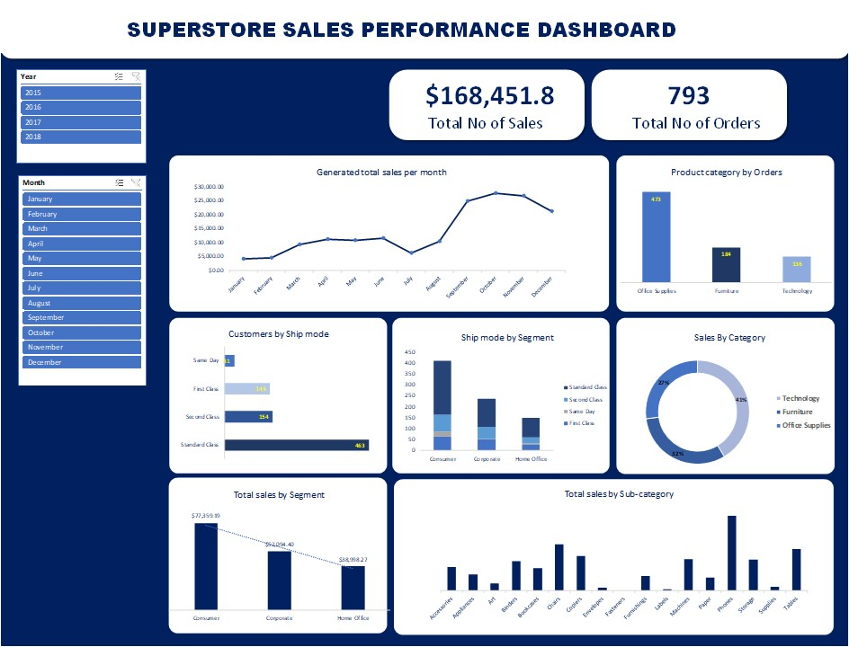

# Superstore-Sales-Perfomance-Dashboard

# About the project
The objective of this Superstore sales performance analysis project is to uncover valuable insights and patterns within the sales data of our superstore. By thoroughly examining the sales data across various product categories, segments, and time periods, our aim is to enhance our sales performance. Through this analysis, we can identify the top-selling products, determine the most successful product categories, and pinpoint the most profitable time frames. Armed with this knowledge, we can fine-tune our sales strategies and ultimately boost our revenue growth.

# Data Sourcing
The dataset used for this analysis was downloaded from kaggle website. The dataset contains information on sales, year, region, category, segment, products, order date, ship mode, sub-categories and states.

# Tech Stack
The analysis was conducted using Excel.

# Dashboard and Analysis

